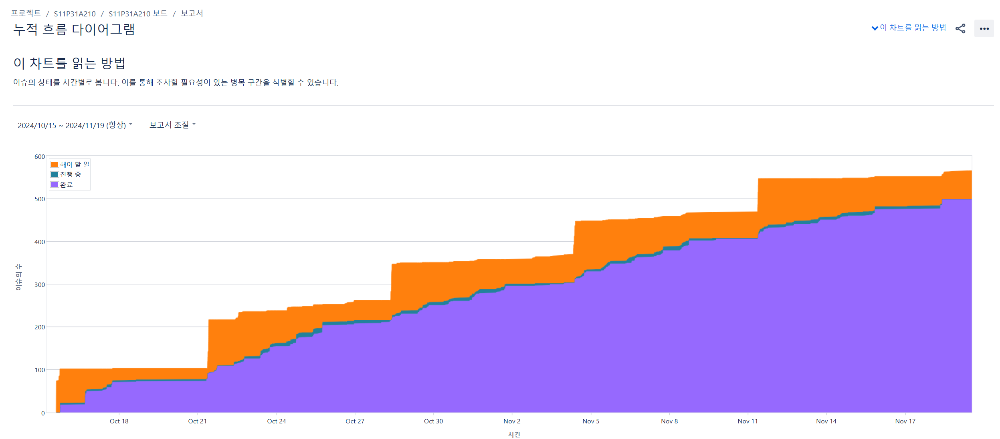

  <h1 style="display: flex; align-items: center; justify-content: center; width: 100%;">
     코플로, CoFlo
  </h1>
  
  <h4>코플로 서비스</h5>
  
2024.10.?? ~ 2024.11.19
  
    
  <a href="">코플로</a>
  &nbsp; | &nbsp; 
  <a href="">리뷰핑 팀 Notion</a>
  &nbsp; | &nbsp; 
   <a href="exec/최종발표.pdf">발표 PPT</a>

 

## 목차

1. [개요](#개요)
2. [핵심 기능 소개](#기능-소개)
3. [서비스 소개](#서비스-소개)
4. [프로젝트 설계](#프로젝트-설계)
5. [개발 환경 및 기술 스택](#개발-환경-및-기술-스택)
6. [팀원 소개](#팀원-소개)

 

## [개요](#목차)

 
 
### **코플로란?**

 
 

## [핵심 기능 소개](#목차)

### 1.

 
 

## [서비스 소개](#목차)

### 1️⃣ <b>메인 페이지</b>

|                     **Login Page**                      |                        **Main Page**                        |                       **Main Page**                        |
| :-----------------------------------------------------: | :---------------------------------------------------------: | :--------------------------------------------------------: |
|  |  |  |

 

### 2️⃣ <b> 페이지</b>

> 사용자가 자신의 목소리를 녹음하여 곡을 만드는 페이지로, MR을 선택하고 바로 녹음할 수 있습니다.

|                      **Melting Page**                      |                      **AI Cover Page**                      |
| :--------------------------------------------------------: | :---------------------------------------------------------: |
|  |  |

 

### 3️⃣ <b> 페이지</b>

> 완성된 커버곡과 멜팅곡을 선택하여 앨범을 발매하는 페이지입니다. 앨범 커버 이미지와 소개가 AI를 통해 자동 생성됩니다.

|                   **Album Register Page**                   |
| :---------------------------------------------------------: |
|  |

 

### 4️⃣ <b> 페이지</b>

> 사용자들이 서로의 앨범을 공유하고 좋아요와 댓글을 남길 수 있는 커뮤니티 공간입니다.

|                     **Community Page**                      |                        **Search Page**                        |
| :---------------------------------------------------------: | :-----------------------------------------------------------: |
|  |  |

|                    **Album Detail Page**                     |                     **Album Streaming Page**                     |                     **Album Comment Page**                     |
| :----------------------------------------------------------: | :--------------------------------------------------------------: | :------------------------------------------------------------: |
|  |  |  |

 

### 5️⃣ <b>마이 페이지</b>

|                          **Info Page**                          |                      **My Album/Song Page**                       |                      **Liked Album/Song Page**                       |
| :-------------------------------------------------------------: | :---------------------------------------------------------------: | :------------------------------------------------------------------: |
|  |  |  |

 
 

## [프로젝트 설계](#목차)

### 시스템 아키텍쳐

 

### ERD

 

### [코플로 API 명세서](./resources/img/api_specification.png)

 
 

## [개발 환경 및 기술 스택](#목차)

|      개발 환경      | 기술 스택                                                                                                                                                                                                                                                                                                                                                                                                                                                                                                                                                                                                                                                                                                                                                                                                                                                       |
| :-----------------: | :-------------------------------------------------------------------------------------------------------------------------------------------------------------------------------------------------------------------------------------------------------------------------------------------------------------------------------------------------------------------------------------------------------------------------------------------------------------------------------------------------------------------------------------------------------------------------------------------------------------------------------------------------------------------------------------------------------------------------------------------------------------------------------------------------------------------------------------------------------------- |
|    **Frontend**     |         |
|     **Backend**     |                                              |
|       **DB**        |                                                                                                                                                                                                                                                                                                                                                                                                                                                                                                                    |
|       **AI**        |                                                                                                                                                                                                                                                                                                                                                                                                                                                                                                                                                                                                                                                    |
|      **Infra**      |                                                                                                                                                                                                                                                                                                                                                                                                                                                                                                                                           |
| **Management Tool** |                                                                                                                                                                                                                    |

 

리뷰핑팀 JIRA

 
 

## [팀원 소개](#목차)

<table align="center">
  <tr>
    <th style="text-align: center;"><a href="https://github.com/anjs124">구승석</a></th>
    <th style="text-align: center;"><a href="https://github.com/btothey99">이보연</a></th>
    <th style="text-align: center;"><a href="https://github.com/hyooun">유승현</a></th>
  </tr>
  <tr>
    <td style="text-align: center;"></td>
    <td style="text-align: center;"></td>
    <td style="text-align: center;"></td>
  </tr>
  <tr>
    <td style="text-align: center;"><b>Frontend</b></td>
    <td style="text-align: center;"><b>Frontend</b></td>
    <td style="text-align: center;"><b>Infra/Backend</b></td>
  </tr>
</table>

<table align="center">
  <tr>
    <th style="text-align: center;"><a href="https://github.com/jmxx219">손지민</a></th>
    <th style="text-align: center;"><a href="https://github.com/fkgnssla">김형민</a></th>
    <th style="text-align: center;"><a href="https://github.com/qsunki">홍선기</a></th>
  </tr>
  <tr>
    <td style="text-align: center;"></td>
    <td style="text-align: center;"></td>
    <td style="text-align: center;"></td>
  </tr>
  <tr>
    <td style="text-align: center;"><b>Backend</b></td>
    <td style="text-align: center;"><b>Backend</b></td>
    <td style="text-align: center;"><b>Backend/AI</b></td>
  </tr>
</table>

 
