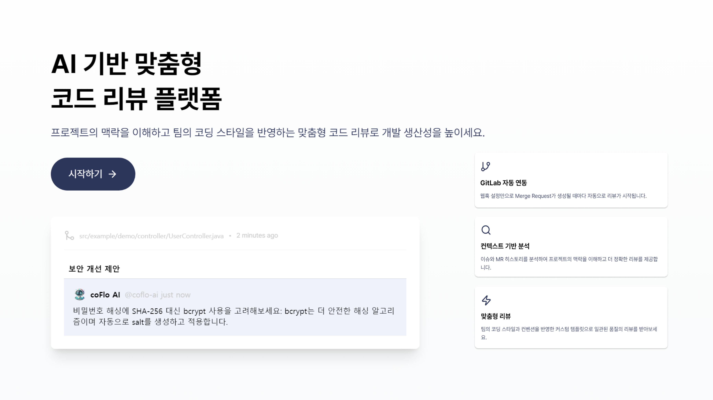
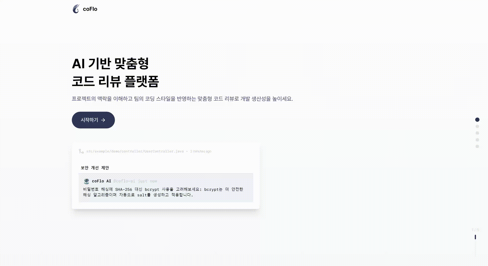
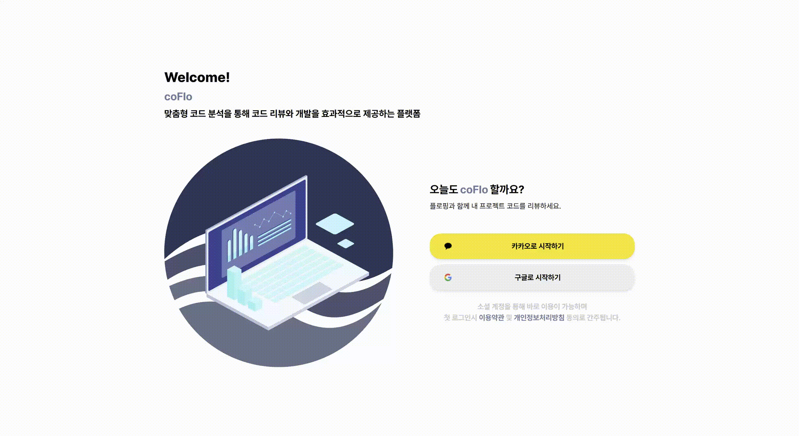
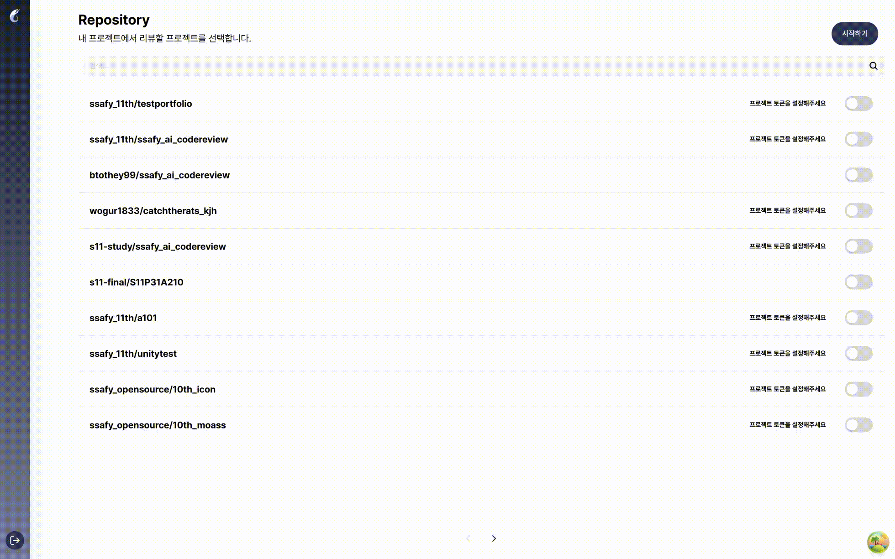
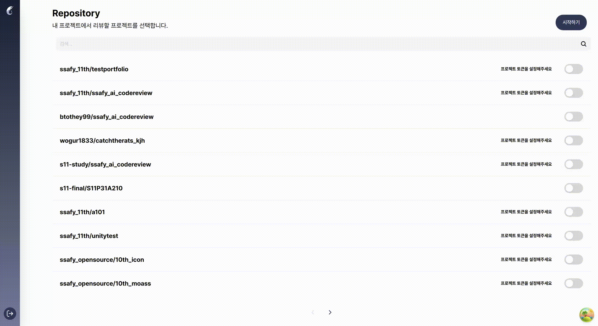
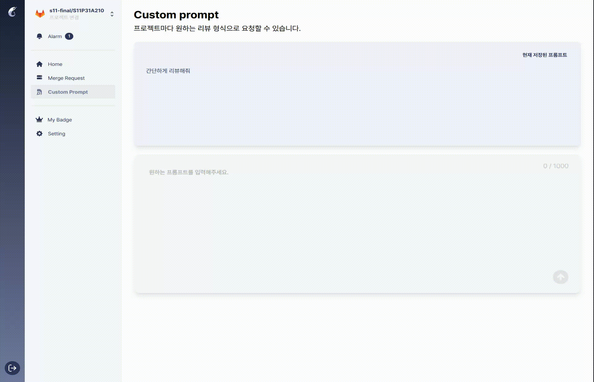
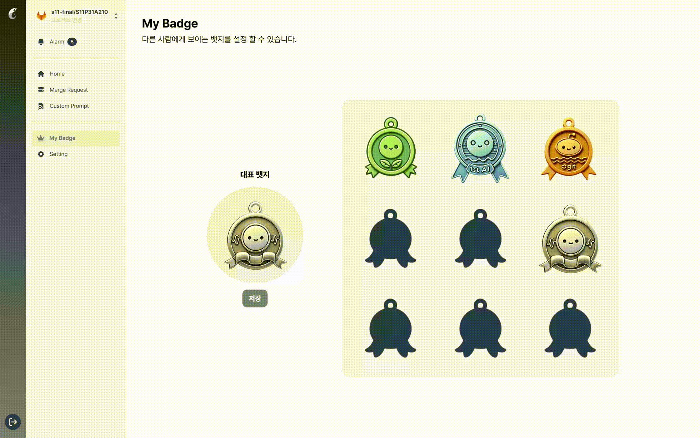
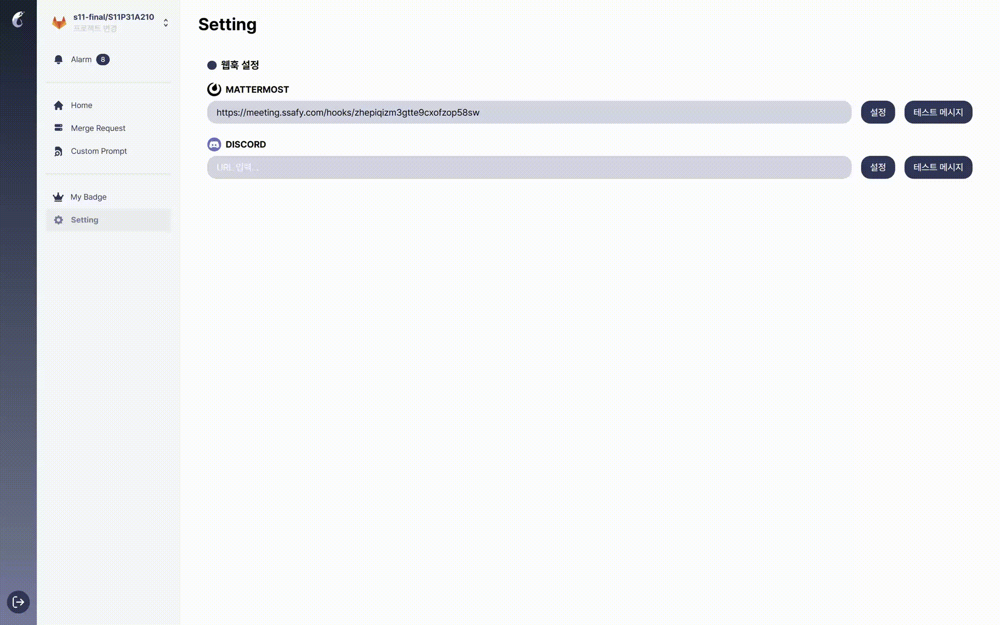
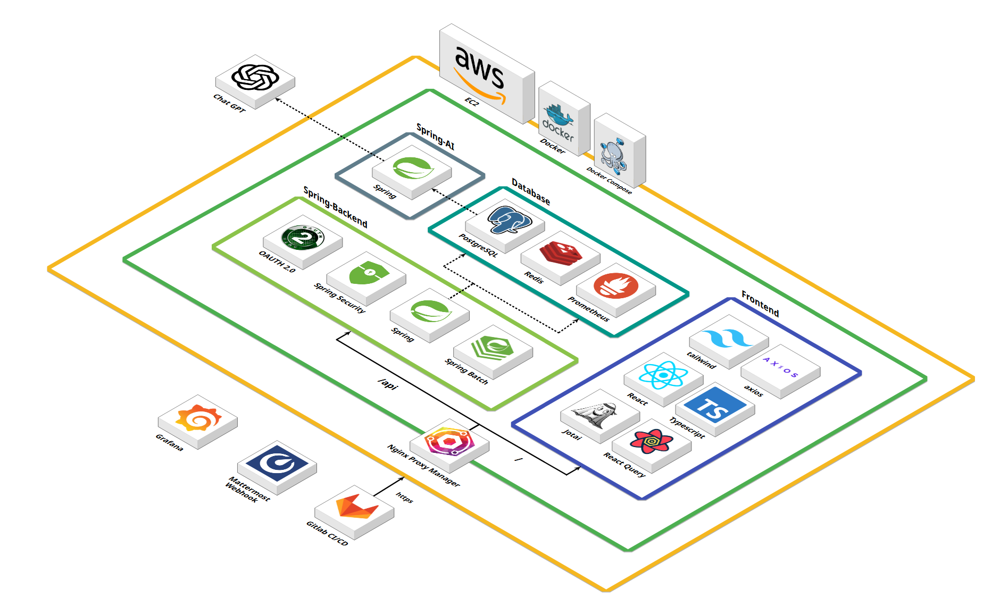
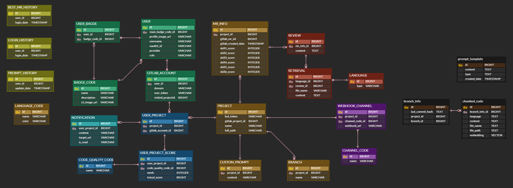

  <h1 style="display: flex; align-items: center; justify-content: center; width: 100%;">
     코플로, CoFlo
  </h1>
  
  <h3>AI 기반 맞춤형 코드 리뷰 플랫폼</h3>
  
2024.10.14 ~ 2024.11.19
  
    
  <a href="https://www.coflo.co.kr/">코플로</a>
  &nbsp; | &nbsp; 
  <a href="https://jmxx219.notion.site/115ced9ff3788076bdd1d0c94a1ecf18?pvs=74">리뷰핑 팀 Notion</a>
  &nbsp; | &nbsp; 
   <a href="exec/최종발표.pdf">발표 PPT</a>

 

## 목차

1. [개요](#개요)
2. [핵심 기능 소개](#기능-소개)
3. [서비스 소개](#서비스-소개)
4. [프로젝트 설계](#프로젝트-설계)
5. [개발 환경 및 기술 스택](#개발-환경-및-기술-스택)
6. [팀원 소개](#팀원-소개)

 

## [개요](#목차)

코드리뷰는 개발자가 가장 선호하는 개발문화입니다. 장점이 많지만 현실적인 문제에 부딫혀 제대로 하지 쉽지 않습니다. 많은 양의 코드리뷰를 하는 것, 리뷰를 기다리는 것 모두 개발 속도를 늦추는 원인이 되기 때문입니다. 그렇기에 이런 시간적 비용을 단축시키고 개발자의 편의를 돕기 위해 맞춤형 코드 분석을 통해 코드 리뷰를 작성하는 AI 리뷰어, coFlo를 기획하게 되었습니다.

 
 
### **코플로란?**

code, flow가 합쳐진 합성어로 코드가 물 흐르듯 자연스럽게 리뷰되고 개선되는 것을 표현했습니다.

 
 

## [핵심 기능 소개](#목차)

### 1. AI 코드 리뷰

- **프로젝트 문맥**을 반영한 코드 리뷰: 프로젝트 코드를 메소드, 함수 단위로 청크하여 저장, 리뷰 생성 시 RAG의 검색데이터로 활용
- **커스텀 프롬프트** 설정: 원하는 리뷰 생성을 위한 프롬프트 수정가능

 

### 2. 코드 리뷰 데이터

- **사용자 코드 평가 지표**(6가지): 가독성, 일관성, 재사용성, 신뢰성, 보안성, 유지보수성에 따른 AI의 MR평가

- **주차별 개인 성장 그래프:** 6가지 지표에 대해 주간 점수 통계

- **코드 뱃지 획득:** 도전과제 달성 시 귀여운 뱃지 획득

- **주간 최고 MR:** AI가 평가한 좋은 MR TOP3

 
 

## [서비스 소개](#목차)

### 1️⃣ <b>로그인 페이지</b>

|                      **Lading Page**                      |
| :-------------------------------------------------------: |
|  |

|                     **Login Page**                      |                     **SignUp Page**                      |
| :-----------------------------------------------------: | :------------------------------------------------------: |
|  |  |

 

### 2️⃣ <b>메인 페이지</b>

> 프로젝트 팀 정보와 함께 6가지 지표에 따른 팀 육각형 그래프와 개인 성장 그래프를 조회할 수 있다.

|                     **Main Page**                      |
| :----------------------------------------------------: |
|  |

|                       **Project Page**                        |                       **Project Page**                        |
| :-----------------------------------------------------------: | :-----------------------------------------------------------: |
|  |  |

 

### 3️⃣ <b>MR 페이지</b>

> MR 리스트를 조회하고, AI 리뷰를 조회하고 재생성한다.

|             **Merge Request Search Page**              |                        **Review Page**                         |
| :----------------------------------------------------: | :------------------------------------------------------------: |
|  |  |

 

### 4️⃣ <b>커스텀 프롬프트 페이지</b>

> AI 리뷰 생성을 위한 커스텀 프롬프트를 등록한다.

|                   **Custom Prompt Page**                   |
| :--------------------------------------------------------: |
|  |

 

### 5️⃣ <b>뱃지 & 설정 페이지</b>

|                    **My Badge Page**                    |                     **Setting Page**                      |
| :-----------------------------------------------------: | :-------------------------------------------------------: |
|  |  |

 
 

## [프로젝트 설계](#목차)

### 시스템 아키텍쳐

 

### ERD

 

### [코플로 API 명세서](./resources/img/api_specification.png)

 

### [리뷰핑팀 JIRA](./resources/img/jira)

 
 

## [개발 환경 및 기술 스택](#목차)

|      개발 환경      | 기술 스택                                                                                                                                                                                                                                                                                                                                                                                                                                                                                                                                                                                                                                                                                                                                                                                                                                                                                                                                                                                                                                            |
| :-----------------: | :--------------------------------------------------------------------------------------------------------------------------------------------------------------------------------------------------------------------------------------------------------------------------------------------------------------------------------------------------------------------------------------------------------------------------------------------------------------------------------------------------------------------------------------------------------------------------------------------------------------------------------------------------------------------------------------------------------------------------------------------------------------------------------------------------------------------------------------------------------------------------------------------------------------------------------------------------------------------------------------------------------------------------------------------------- |
|    **Frontend**     |                                                                                                                                                                                                                                                                                                               |
|     **Backend**     |          |
|       **DB**        |                                                                                                                                                                                                                                                                                                                                                                                                                                                                                                                                                                                                                                                                                                                                                                                                                                   |
|       **AI**        |                                                                                                                                                                                                                                                                                                                                                                                                                                                                                                                                                                                                                                                                                                                                                                                                                                            |
|      **Infra**      |                                                                                                                                                                                                                                                                                                                                                                                                                                                                                                                                                                                                                                                                                    |
|   **Monitoring**    |                                                                                                                                                                                                                                                                                                                                                                                                                                                                                                                                                                                                     |
| **Management Tool** |                                                                                                                                                                                                                                                                                                                                                                                                         |

 
 

## [팀원 소개](#목차)

<table align="center">
  <tr>
    <th style="text-align: center;"><a href="https://github.com/anjs124">구승석</a></th>
    <th style="text-align: center;"><a href="https://github.com/btothey99">이보연</a></th>
    <th style="text-align: center;"><a href="https://github.com/hyooun">유승현</a></th>
  </tr>
  <tr>
    <td style="text-align: center;"></td>
    <td style="text-align: center;"></td>
    <td style="text-align: center;"></td>
  </tr>
  <tr>
    <td style="text-align: center;"><b>Frontend</b></td>
    <td style="text-align: center;"><b>Frontend</b></td>
    <td style="text-align: center;"><b>Infra/Backend</b></td>
  </tr>
</table>

<table align="center">
  <tr>
    <th style="text-align: center;"><a href="https://github.com/jmxx219">손지민</a></th>
    <th style="text-align: center;"><a href="https://github.com/fkgnssla">김형민</a></th>
    <th style="text-align: center;"><a href="https://github.com/qsunki">홍선기</a></th>
  </tr>
  <tr>
    <td style="text-align: center;"></td>
    <td style="text-align: center;"></td>
    <td style="text-align: center;"></td>
  </tr>
  <tr>
    <td style="text-align: center;"><b>Backend</b></td>
    <td style="text-align: center;"><b>Backend</b></td>
    <td style="text-align: center;"><b>Backend/AI</b></td>
  </tr>
</table>

 
